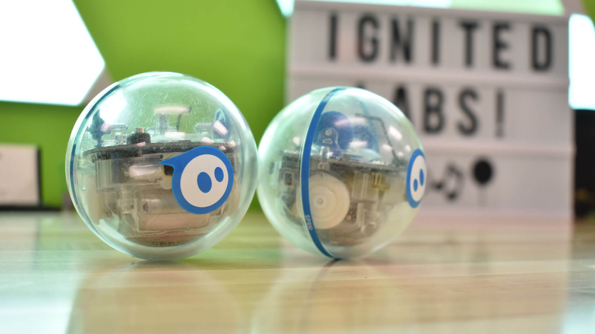

# sphero_swarm
Created by Anaam Mostafiz for the IgnitED Labs at Arizona State University. 



# Sphero Swarm

Sphero's are spherical robots that can drive around and change colors. While you can only control one Sphero at a time with the Sphero phone app, you can control multiple at a time with the power of the Robot Operating System (ROS)! This can lead to some pretty interesting group, or swarm, behaviors.

Swarms are found throughout nature, like with bugs, birds, and fish. Using ROS and simulations, we can explore a few Sphero swarm behaviors to examine how swarms can be useful in nature and robotics.

### *Notes*

This project can be run online without any setup at https://www.theconstructsim.com/ by forking the Sphero Swarm public rosject there by user anaam.mostafiz.

To get a local copy, clone this repository into your catkin workspace and run catkin_make.
This code requires Ubuntu 20.04, ROS Noetic, and OpenCV.
If you are interested in running this code with actual Sphero's, see the [sphero_driver_v2](https://github.com/larics/sphero_robot/tree/master/sphero_driver_v2) and/or [sphero_sprk_ros](https://github.com/antonellabarisic/sphero_sprk_ros/tree/noetic-devel).

## Leader-Follower

Animal herds in the wild often exhibit leader-follower behavior. Older, more experienced animals take the lead in guiding the herd to water sources, feeding areas, and safe paths through their environment. The rest of the herd follows the leader, benefiting from the wisdom and experience of the leading individual. In robotics, leader-follower behavior can be applied in exploration tasks or environmental monitoring where a leader robot with advanced sensors and navigation capabilities explores unknown terrain, and the less-advanced follower robots follow its movements.

To see leader-follower in action, first we need to launch the simulation. This will open a world with 3 Sphero SPRK+ robots in a rectangular arena with an overhead camera.


```
roslaunch sphero_swarm map_sprk3.launch
```

Then, we need some way to distinguish between each robot so we can track their individual locations. Here we will change the colors of the robots and use the overhead camera to track each color.


```
roslaunch sphero_swarm rgb_track.launch
```

Now we can tell robot 1 to follow robot 0, and robot 2 to follow robot 1. In essence this makes robot 0 the leader, and robot 1 and 2 the followers.


```
rosrun sphero_swarm follow_lead.py 1 0
```


```
rosrun sphero_swarm follow_lead.py 2 1
```

Finally, we can move robot 0 around using the keyboard and watch how the others follow!


```
rosrun teleop_twist_keyboard teleop_twist_keyboard.py cmd_vel:=sphero_0/cmd_vel
```

You should get something like the video below. Click on the below code cell and press shift+Enter to load the video.


```
from I.display import HTML

HTML("""
    <video alt="swarm_follow" width="640" height="480" controls>
        <source src="videos/swarm_follow.mp4" type="video/mp4">
    </video>
""")
```


<video alt="swarm_follow" width="640" height="480" controls>
    <source src="videos/swarm_follow.mp4" type="video/mp4">
</video>


## Random Color Synchronization

Random color synchronization is a form of collective decision making. Honeybee swarms are known for their collective decision-making when selecting a new hive location. Scout bees explore potential nesting sites and communicate their findings through intricate dances. The swarm reaches a consensus, and the majority of bees align their decisions based on the information shared during these dances, ensuring a democratic and effective choice for the new hive. In a warehouse where items need to be retrieved and restocked, a swarm of robots can engage in collective decision-making to optimize the overall efficiency. Each robot collects information about the status of different shelves, the availability of items, and the current demand. Through communication and a consensus algorithm, the robots collectively decide on the priority of tasks.

To see random color synchronization in action, first we need to launch the simulation. This will open a dark world with 7 Sphero SPRK+ robots, and a close overhead camera.


```
roslaunch sphero_swarm dark_sprk7.launch
```

Then, we need to tell each robot to select a random color.


```
roslaunch sphero_swarm sync_7.launch
```

Finally, we use the camera to perform a clustering algorithm that identifies the most common colors. The robots will then randomly reselect one of these colors based on their popularity until all robots have the same color. Due to the limited resources of The Construct Sim's virtual workspace, the clustering algorithm may take a few minutes to complete. 


```
rosrun sphero_swarm color_cluster.py 7
```

You should get something like the video below.


```
from I.display import HTML

HTML("""
    <video alt="swarm_sync4" width="640" height="480" controls>
        <source src="videos/swarm_sync4.mp4" type="video/mp4">
    </video>
""")
```


<video alt="swarm_sync4" width="640" height="480" controls>
    <source src="videos/swarm_sync4.mp4" type="video/mp4">
</video>


## Circle Formation

Starlings showcase complex formations as thousands of birds move together in synchronized patterns, creating dynamic shapes in the sky. These formations help protect the flock from predators and improve overall group cohesion. In the realm of entertainment, a swarm of drones can be deployed for captivating light shows and aerial displays. These drones can be equipped with colorful LED lights and programmed to perform intricate formations, creating dynamic shapes, logos, or even animated scenes in the night sky.

To see circle formation in action, we need to launch the simulation. This will open a world with 7 Sphero SPRK+ robots in a rectangular arena with an overhead camera.


```
roslaunch sphero_swarm map_sprk7.launch
```

Here we will track each robot by estimating its most probable location based on the previous camera frame. To initialize the locations, we will turn on the lights of each robot in order one by one.


```
rosrun sphero_swarm blob_track.py
```

Finally, we can tell the robots to form a circle. The robots do this by using an artificial potential field, which attracts them to their goal position and repels them from other robots.


```
rosrun sphero_swarm form_circle.py
```

You should get something like the video below. Click on the below code and press shift+Enter to load the video.


```
from I.display import HTML

HTML("""
    <video alt="swarm_circle" width="640" height="480" controls>
        <source src="videos/swarm_circle.mp4" type="video/mp4">
    </video>
""")
```


<video alt="swarm_circle" width="640" height="480" controls>
    <source src="videos/swarm_circle.mp4" type="video/mp4">
</video>


## Topological Mapping

Ant colonies use pheromone trails to create topological maps of their surroundings. These trails guide other ants to food sources and help them navigate through their environment efficiently. Topological mapping in robotics involves creating a map that captures the connectivity and relationships between different locations in an environment. Swarm robots can collaboratively explore an unknown area, sharing information about key locations and creating a map that reflects the topology of the space. This approach is valuable in tasks like exploration of disaster-stricken areas or mapping challenging terrains.

To see topological mapping in action, first we need to launch the simulation. This will open a world with 7 Sphero Mini robots in a rectangular arena with obstacles.


```
roslaunch sphero_swarm obs_mini7.launch
```

Here we will track each robot using their built-in odometry, which basically monitors the rotations of its motors to calculate its current position.


```
roslaunch sphero_swarm odom_track7.launch
```

Then, we can tell the robots to randomly move around, using an artificial potential field to repel from other robots.


```
rosrun sphero_swarm walk_rand.py
```

Finally, we will keep track of the position history of each robot to form a map that highlights all the locations the robots have reached, leaving only the obstacle locations empty on the map over time. This may take a few minutes.


```
rosrun sphero_swarm pos_map.py
```

You should get something like the video below (shown sped up). Click on the below code and press shift+Enter to load the video.


```
from I.display import HTML

HTML("""
    <video alt="swarm_mapping" width="640" height="480" controls>
        <source src="videos/swarm_mapping.mp4" type="video/mp4">
    </video>
""")
```


<video alt="swarm_mapping" width="640" height="480" controls>
    <source src="videos/swarm_mapping.mp4" type="video/mp4">
</video>


## Conclusion

In conclusion, swarms can perform tasks that an individual could not do efficiently or at all. Creatures generally use swarms to improve their survivability, while robots can use swarms to assist humans in a variety of industries and environments. Here we have used Sphero swarms as an educational tool. Feel free to play around with the code to make your own swarm simulations. If you are interested in using a Sphero robot for yourself, you can schedule an in-person visit the IgnitED Labs at Arizona State University through our website: https://ignitedlabs.education.asu.edu/. While there are currently connection issues with the actual Sphero swarm, you can bring some friends to each control a Sphero and create your own swarm behaviors, using the Sphero obstacles and playsets available. Finally, below are some videos of actual Sphero swarms to enjoy.

https://www.youtube.com/watch?v=0UCpf7mBZIw

https://www.youtube.com/watch?v=fOGTdkHufvU


